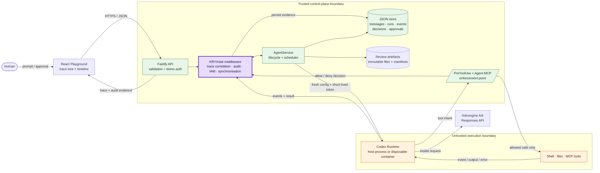
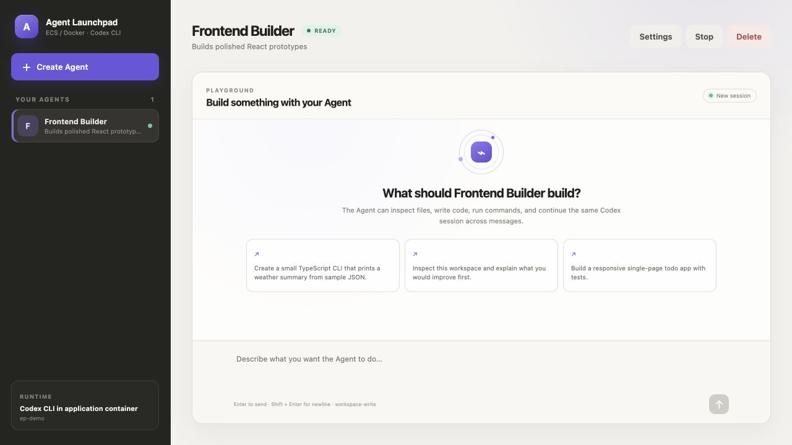

# KRYXstal — clear middleware for Agent runs

KRYXstal is trace, audit, and coordination middleware for Volc Agent Launchpad.
Like crystal, it makes opaque multi-Agent runs clear: one causal view connects
the prompt, Agents, model runs, tool events, policy decisions, conflicts, and
final result. Launchpad supplies Agent CRUD, browser Playground, persistent
workspaces, and Codex CLI backed by Volcengine Ark Responses API.

Run it locally with Docker, Colima, or rootless Podman, or deploy it to
Volcengine ECS.

> [!WARNING]
> This is a single-user proof of concept. It has Agent identity, IAM,
> synchronisation, trace, and audit middleware, but no human identity, tenancy,
> production secret manager, distributed store, or hardened multi-tenant
> sandbox. Do not use production data or credentials. See
> [SECURITY.md](SECURITY.md).

## Selected track and rationale

**Track: Glass Box — trace, audit, and observability.** Multi-Agent work crosses
channels, runtimes, tools, and policy checks. Flat logs cannot quickly answer
“Why did this Agent fail?” KRYXstal propagates a `traceId` and causal parent
through that path, records runtime events and middleware decisions, and exposes
one trace tree/timeline. Synchronisation conflicts and policy denials stay
distinct, so operator sees both what happened and why.

## One-page architecture



Solid arrows show execution/data flow. KRYXstal is inside trusted control plane;
Agent Runtime and tools are treated as untrusted. `PreToolUse` and Agent MCP
callbacks are enforcement/instrumentation point: request fails closed when
identity is invalid or control plane is unavailable. Ark credential stays in
Runtime environment and never reaches browser.

## Screenshots

### Agent Playground



### Create an Agent


## Current features

### Agent lifecycle and identity

- Create, inspect, edit, start, stop, and delete principal Agents from browser.
- Durable UUID identity, status, parent/root principal links, instructions,
  policy, workspace, Codex thread, error, and timestamps.
- Status lifecycle: `ready`, `busy`, `stopped`, `error`, `closed`.
- Human creates durable **principals**. Agents spawn narrower **sessions** under
  parent authority; maximum depth three.
- Every Agent receives private DM, separate workspace, separate Codex session,
  and generated platform `AGENTS.md`.
- Delete cancels execution, closes descendants, removes active metadata, and
  archives workspace under `workspaces/.deleted/`.

### Channels and multi-Agent collaboration

- Slack-shaped public, DM, and system channels.
- `#general` and human-only `#approvals` bootstrapped automatically.
- Humans and authorised Agents create public channels; humans can archive
  ordinary public channels once active Runs and pending approvals finish.
  `#general`, system channels, and DMs cannot be deleted.
- Human, principal, session, and system authors; normal, system, denial,
  spawn, approval, and conflict messages.
- DMs wake eligible members. Public channels wake `@name`, session slug,
  `@all`, or `@everyone` recipients.
- Replies to Agent questions route back to asker automatically through causal
  message/Run lineage.
- Busy Agent wakes coalesce by channel and drain serially.
- Shared-task default uses `@everyone`. Optional `TURN_TAKING=on` wakes next
  established participant round-robin.
- Exact `[no reply]` output posts nothing and wakes nobody; in turn-taking mode
  it passes turn until round ends.
- Configurable chatter and trace budgets stop runaway Agent conversations
  (both default 64).

### Per-channel synchronisation

- Every message has strict, 1-based, per-channel sequence; channel tracks
  `lastSeq`.
- Server-owned read cursor tracks channel sequence used for freshness checks;
  pagination edge cases are documented in future-work gaps.
- FIFO lock per resource, five-second bounded wait, ten-second expiring lease.
- Read-before-act enforced for `post_message` and automatic final replies.
- Validate and commit run inside one store mutation under lock, accepting one
  current writer under contention.
- Stale/busy write returns structured HTTP 409 conflict: winner, unseen state,
  rejected content, cursor/head, attempt, and next action.
- Policy denial remains HTTP 403. Synchronisation conflict is separate
  Decision effect, never confused with missing permission.
- Stale automatic reply is withheld; Agent receives conflict-triggered
  regenerate Run and re-plans from winning state.
- Conflict chain capped at three attempts. Normal pending wake and regeneration
  merge into one turn.
- Channel-name creation and approval resolution use same synchronised
  compare-and-set primitive.
- Product channel/trace views hide internal race notices; Run cards and audit
  retain full evidence.

See [Synchronisation](docs/SYNCHRONISATION.md) for protocol and invariants.

### IAM policy and delegation

- AWS-like semantics: explicit deny wins, matching allow next, implicit deny
  otherwise.
- Statements contain effect, globbed actions, and globbed resources.
- Built-in actions cover channel read/post/create, shell execution, filesystem
  writes, network, Agent spawn/close, principal requests, capability requests,
  and review-artefact publish/read.
- External tools use namespaced actions `mcp:<server>:<tool>`.
- Channel resources use `channel:<name>`; shell resources use token-prefix
  `cmd:<argv>` matching.
- Reader, worker, deployer, admin presets plus custom policy editor.
- Channel membership and policy both required.
- Parent can delegate only actions it holds and explicitly marks delegable.
- Session receives requested subset plus every parent deny; descendant cannot
  exceed ancestor authority.
- Ancestor-only session close; cascade closure.

See [Multi-agent IAM](docs/MULTI_AGENT_IAM.md) for complete model.

### Runtime enforcement

Each turn gets freshly rendered per-Agent `$CODEX_HOME`:

1. unavailable Launchpad/external MCP tools omitted;
2. literal denied commands compiled into Codex execpolicy rules;
3. fail-closed `PreToolUse` hook calls `/api/iam/evaluate`;
4. Agent MCP API re-checks policy and membership server-side;
5. Codex sandbox and optional outer Runtime container contain execution.

Additional controls:

- Short-lived random per-Run `AGENT_TOKEN`, revoked when Run ends.
- `approval_policy = never`; model cannot approve itself.
- Native Codex multi-Agent orchestration disabled; Launchpad owns delegation.
- Read-only sandbox when filesystem write can never be granted.
- Network/web search disabled when network cannot ever be granted.
- Agent/model shell excludes `AGENT_TOKEN`, `ARK_API_KEY`, and
  `LAUNCHPAD_URL`.
- Hook fails closed on invalid input, absent identity, timeout, or unreachable
  control plane.
- Every authorisation/synchronisation check records actor, Run, source, tool,
  action, resource, effect, reason, trace, and time.

### Human approvals and escalation

- Agent requests new durable principal through approval card in `#approvals`.
- Agent requests missing capability in working channel; request mirrors to
  `#approvals`.
- Human choices: deny, allow once for next Run, or allow forever.
- One-time grant binds to Run, affects generated tool/rule surface, then is
  consumed.
- Permanent grant removes covering deny and appends explicit allow.
- Resolution, Decision, messages, and requester wake retain causal linkage.
- Approval resolution is race-safe: concurrent clicks resolve exactly once.

### Secure review-artefact handoff

- Isolated Agent workspaces remain private; no peer workspace is mounted or
  exposed through host paths.
- A publishing Agent selects explicit regular files with `publish_for_review`.
  Launchpad creates an immutable UUID artefact containing file hashes, sizes,
  publisher Run/trace lineage, and an optional note.
- A reviewing Agent lists the manifest, then reads only published paths through
  `read_review_artifact`; every read revalidates manifest metadata, size, and
  SHA-256.
- IAM checks `artifact:publish` and exact `artifact:<id>` reads. Reader preset
  must request scoped human approval before tool becomes available for its next
  Run; worker preset may publish but not read.
- Absolute paths, traversal, symlinks, directories, sensitive filenames, and
  configured size/count excesses fail closed.

See [Multi-agent IAM](docs/MULTI_AGENT_IAM.md#secure-review-artifact-handoff)
for protocol, storage, limits, and threat boundary.

### Traces, Runs, and audit

- Every human-rooted chain carries `traceId`; derived messages carry
  `parentMessageId`; Runs retain trigger message and reply channel.
- Cross-channel trace query returns root, messages, Runs, decisions, channels,
  Agents, and live status.
- UI supports causal tree and chronological timeline with channel hops.
- Runs: queued/running/completed/failed/cancelled, trigger type, prompt, output,
  error, usage, timestamps, `seenSeq`, conflicts, silent state.
- Events: command execution, MCP call, file change, web search, reasoning,
  synchronisation conflict.
- Live events visible before completion; persisted events capped at 300 per
  Run and details clipped to 4,000 characters.
- Decision history is globally capped at the newest 2,000 records; this POC
  has no archival audit sink.
- Agent inspector shows lifecycle, policy, channels, sessions, Runs, and
  decisions. Global inspector provides full audit view.
- Fastify logs redact authorisation and cookie headers.

### External MCP integrations

- Register streamable HTTP or local stdio MCP servers.
- OAuth or no-auth connection; browser-assisted `codex mcp login` for HTTP.
- Shared control-plane login or distinct per-Agent provider identity.
- Tool discovery through `tools/list`; metadata includes description and
  read-only hint.
- Integration server/tool hidden unless Agent policy may use it.
- Per-Agent `enabled_tools` list plus hook check on every invocation.
- UI supports add, connect, logout, rediscover, remove, inspect tools, grant
  whole integration or individual tool.

### Execution, workspaces, and reliability

- Asynchronous Runs with one active Run per Agent.
- First turn creates Codex thread; subsequent turns resume it.
- Persistent per-Agent workspaces and Codex homes.
- Configurable timeout and output byte ceiling.
- Stop/cancel terminates a host Codex process with `SIGTERM` then `SIGKILL`;
  disposable container Runs are force-removed.
- Restart reconciliation cancels orphaned Runs and resets busy Agents.
- Synchronisation cursors rebuild from persisted Run/message state.
- Run errors persist and post understandable channel notice.
- Generated workspace instructions track role, policy, channels, available
  tools, and collaboration protocol.

### Runtime providers and deployment

- Host-process runner for development/ECS profile.
- Disposable Docker, Colima, or Podman container per local turn.
- Container runs configured non-root user with init, CPU/memory/PID limits,
  all Linux capabilities dropped, and `no-new-privileges`.
- Only workspace, Agent Codex home, and read-only runtime scripts mounted.
- Docker host and rootless Podman compatibility handled.
- Ark Responses API or local Codex login/model provider.
- Docker Compose, existing ECS deployment script, and Terraform environment.

### Persistence, API, UI, and verification

- Versioned JSON database for Agents, integrations, grants, channels, messages,
  Runs, decisions, approvals, and review-artefact manifests; published bytes
  live separately under `APP_DATA_DIR/review-artifacts/`.
- Serial copy-on-write mutations and atomic temporary-file rename.
- Mode `0600` for metadata and generated policy/config files.
- v1→v2 migration plus idempotent message sequence assignment.
- Fastify API with Zod validation and optional timing-safe shared demo token.
- React UI for channels, traces, Agents, policies, approvals, integrations,
  Runs, decisions, lifecycle, and runtime status.
- Tests cover lifecycle, IAM, delegation, scheduler, synchronisation,
  concurrency, approval races, traces, integrations, runner/container protocol,
  persistence/migration, secure review handoff, hook/MCP runtime, and policy
  semantics.
- `npm run check` runs TypeScript checks, server tests, and production builds.

Future designs and implementation guardrails live in
[Future middleware ideas](docs/FUTURE_IDEAS.md).

## Debugging with a local Codex login

If Codex CLI is installed and logged in on your machine, you can skip Ark:

```bash
MODEL_PROVIDER=local-codex npm run dev        # API on :3000, UI on :5173
```

The server also loads a gitignored `.env` at the repo root on startup (real
environment variables take precedence), so putting `MODEL_PROVIDER=local-codex`
there makes plain `npm run dev` use your login. `npm run poc` always uses Ark.

Each agent still gets its own generated `$CODEX_HOME` (policy, rules, hooks,
sessions); only `auth.json` is linked from `~/.codex` (override with
`LOCAL_CODEX_HOME`). Set `CODEX_MODEL` to pick a model. Agents run as host
processes in this mode, so keep it to development machines.

## Multi-agent IAM

See [docs/MULTI_AGENT_IAM.md](docs/MULTI_AGENT_IAM.md) for the model, the
enforcement path, the agent-facing API, and the demo script.

Short version:

| Concept | What it is |
| --- | --- |
| Principal | An Agent the human created. Has a policy (`allow`/`deny` statements over actions and resources) and a `delegable` list. |
| Session | An Agent spawned by another Agent. Its policy is `requested ∩ parent`, plus every parent deny. Closes with its parent. |
| Channel | Where everything happens. Agent replies, denials, spawns, lost races and approval requests are all messages. |
| Decision | One row per authorisation or synchronisation check: who, action, resource, allow/deny/conflict, why. |

Every Codex turn is started with a fresh `$CODEX_HOME` rendered from the
Agent's policy (`config.toml`, `rules/policy.rules`, `hooks.json`) and a
short-lived `AGENT_TOKEN`. The runtime calls back into `/api/iam/evaluate`
before every tool call and into `/api/agent/*` for channel and delegation
tools.

## Synchronisation

Agents woken by the same message run concurrently. Every write to a channel
— the `post_message` tool and the automatic post of a run's reply — is
accepted only if the agent has seen the whole channel; otherwise it loses the
race and gets feedback naming the winner, quoting what they posted, listing
the unseen messages and asking for a new action. See
[docs/SYNCHRONISATION.md](docs/SYNCHRONISATION.md).

Try it with three agents in `#general`:

```text
@everyone count down from 10 to 1, one number per message, take turns.
```

All three answer "10 @everyone"; one is accepted, the other two lose the race
and regenerate. Each accepted number wakes everyone again, so every step is a
race that exactly one agent wins, down to 1. The channel shows only the
countdown; the run cards and audit log show who got there first.

## Requirements

- Node.js 22+
- npm 10+
- Docker, Colima, or Podman
- A Volcengine Ark API key and endpoint that supports the Responses API

Codex CLI is included in the Runtime image and is not required on the host.

## Local browser SOP

### 1. Check the local tools

Install Node.js 22+ and one supported container engine, then verify them:

```bash
node --version
npm --version
docker --version        # Docker Desktop, Docker Engine, or Colima
podman --version        # Use this instead when running Podman
```

Only one container engine is required. Codex CLI is already included in the
Runtime image.

### 2. Clone the repository

```bash
git clone <repository-url> volc-agent-launchpad
cd volc-agent-launchpad
```

Skip this step when already working from the repository root.

### 3. Start the POC

```bash
ARK_API_KEY=your-ark-api-key \
ARK_MODEL=ep-your-endpoint-id \
npm run poc
```

The first run installs Node.js dependencies and builds the Runtime image. The
script automatically selects Docker, Colima, or Podman.

### 4. Open the browser

Visit <http://localhost:3000>, or open it from the terminal:

```bash
open http://localhost:3000       # macOS
xdg-open http://localhost:3000   # Linux desktop
```

In the Web UI:

1. Select **Create Agent**.
2. Enter a name, description, and workspace instructions.
3. Select **Create Agent** again.
4. Enter a task in the Playground, for example:

   ```text
   Create a TypeScript hello-world CLI, add a test, and run it.
   ```

The Agent can write files, run commands, and continue the same Codex session in
later messages.

### 5. Stop and resume

Press `Ctrl+C` in the startup terminal. The script removes temporary Runtime
containers but keeps Agent workspaces and conversations.

- macOS state: `~/.volc-agent-launchpad/`
- Linux state: `.local/`
- Custom location: set `LOCAL_POC_DATA_ROOT`

Run the same `npm run poc` command to continue later.

### Select a specific container engine

Force Podman when multiple engines are installed:

```bash
CONTAINER_ENGINE=podman \
ARK_API_KEY=your-ark-api-key \
ARK_MODEL=ep-your-endpoint-id \
npm run poc
```

Colima uses `CONTAINER_ENGINE=docker` because it exposes the Docker CLI.

For a clean Linux host, follow the
[rootless Podman setup](docs/LOCAL_POC.md#rootless-podman-on-linux).

## Docker Compose

Create and edit the configuration:

```bash
./scripts/bootstrap-local.sh
```

Required values in `.env`:

```dotenv
ARK_API_KEY=your-ark-api-key
ARK_MODEL=ep-your-endpoint-id
APP_AUTH_TOKEN=replace-with-at-least-24-random-characters
```

Start the application:

```bash
docker compose up --build
```

Open <http://localhost:3000>. Stop it without deleting Agent data:

```bash
docker compose down
```

## Development

```bash
npm install
cp .env.example .env
npm install --global @openai/codex@0.150.1
npm run dev
```

- Web UI: <http://localhost:5173>
- API: <http://localhost:3000>

Use local paths in `.env` when running outside Docker:

```dotenv
APP_DATA_DIR=.data
AGENT_WORKSPACE_ROOT=workspaces
CODEX_HOME=codex-home
```

## Deployment

- [Existing Linux ECS with Docker](docs/DEPLOYMENT.md#existing-linux-ecs)
- [Complete Volcengine environment with Terraform](docs/DEPLOYMENT.md#terraform-deployment)
- [Local Docker, Colima, and Podman details](docs/LOCAL_POC.md)

The existing-ECS script deploys from the current source tree:

```bash
cp .env.example .env.production
./scripts/deploy-existing-ecs.sh .env.production
```

The Terraform path provisions VPC, subnet, security group, ECS, and EIP:

```bash
cp deploy/volcengine/terraform.tfvars.example \
  deploy/volcengine/terraform.tfvars
./scripts/deploy-volcengine.sh
```

## Configuration

| Variable | Default | Purpose |
| --- | --- | --- |
| `ARK_API_KEY` | Required | Ark model API key. |
| `ARK_MODEL` | Required | Responses-capable endpoint or model ID. |
| `ARK_BASE_URL` | Beijing v3 endpoint | Ark OpenAI-compatible API URL. |
| `APP_AUTH_TOKEN` | Empty on loopback | Shared demo token; use 24+ random characters remotely. |
| `MODEL_PROVIDER` | `ark` | `local-codex` reuses an existing local Codex login for development. |
| `CODEX_MODEL` | Codex CLI default | Optional model override in `local-codex` mode. |
| `RUNTIME_PROVIDER` | `local-process` | `container` for disposable local Runtime containers. |
| `CODEX_SANDBOX_MODE` | `workspace-write` | Codex inner sandbox mode. |
| `CODEX_TIMEOUT_MS` | `600000` | Maximum duration of one turn. |
| `CODEX_MAX_OUTPUT_BYTES` | `2097152` | Maximum captured Codex output per turn. |
| `REVIEW_ARTIFACT_MAX_FILES` | `50` | Maximum files in one immutable review artefact. |
| `REVIEW_ARTIFACT_MAX_TOTAL_BYTES` | `10485760` | Maximum total published bytes per review artefact. |
| `REVIEW_ARTIFACT_MAX_RESPONSE_BYTES` | `1048576` | Maximum manifest or file-read response size. |
| `CHATTER_BUDGET` | `64` | Agent turns in one channel without a human message before it pauses. |
| `TRACE_BUDGET` | `64` | Agent runs one human prompt may cause before its chain pauses. |
| `TURN_TAKING` | `off` | `on` wakes the next collaborator round-robin instead of relying on `@everyone`. |
| `LOCAL_POC_DATA_ROOT` | Platform-specific | Local metadata, workspace, and session directory. |

See [.env.example](.env.example) for all Runtime and resource-limit options.

## How it works

The first turn uses `codex exec`; later turns resume the stored Codex thread.
Deleting an Agent archives its workspace under `workspaces/.deleted/`.

See [one-page architecture](#one-page-architecture) above and
[docs/ARCHITECTURE.md](docs/ARCHITECTURE.md) for component details and extension
boundaries.

## KRYXstal tests and demo evidence

Run focused middleware contract tests:

```bash
npm run test -w @launchpad/server -- src/kryxstal.test.ts
```

Tests prove both judge-facing paths:

- normal case: prompt, Run, command event, allow decision, and reply share one
  causal trace;
- failure/denial case: blocked destructive command keeps deny reason and denial
  message in same trace.

For three-minute live demo:

1. Send one Agent a normal task, open its trace, and show linked Run, event,
   decision, and answer.
2. Ask it to perform policy-blocked action such as `rm -rf /`; show protected
   action did not run and inspect deny reason in same trace.
3. Optional collaboration proof: run `@everyone count down from 10 to 1, one
   number per message, take turns.` Show clean channel result, then conflicts
   and regeneration in trace/audit view.

## Known limitations

- Single human and single-process JSON store; no tenancy or distributed locks.
- Trace payloads may contain sensitive model/tool content; only HTTP auth and
  cookie headers are redacted.
- Local containers reduce blast radius but are not hardened multi-tenant
  isolation.
- Agent deletion removes Runs from active database; long-term audit is not
  tamper-evident.
- Decision retention is capped at 2,000 records and has no external audit
  archive.
- Review artefacts are local immutable snapshots with integrity checks, not a
  signed or externally durable evidence store; lifecycle cleanup is manual.

## Validation

```bash
npm run check
terraform fmt -check -recursive deploy/volcengine
docker compose config
```

## Documentation

- [Architecture](docs/ARCHITECTURE.md)
- [Multi-agent IAM](docs/MULTI_AGENT_IAM.md)
- [Synchronisation](docs/SYNCHRONISATION.md)
- [Future middleware ideas and implementation guardrails](docs/FUTURE_IDEAS.md)
- [Local POC](docs/LOCAL_POC.md)
- [Deployment](docs/DEPLOYMENT.md)
- [Hackathon extension guide](docs/HACKATHON_EXTENSION_GUIDE.md)
- [Security policy](SECURITY.md)
- [Contributing](CONTRIBUTING.md)

## License

[MIT](LICENSE)
