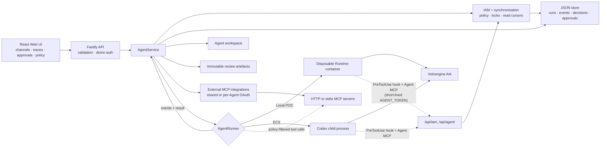

# Architecture

Volc Agent Launchpad is a single-node control plane for hackathon use.



## Components

### Web UI

Manages Agents, policies, channels, approvals, integrations, and lifecycle
actions; submits prompts; polls asynchronous Runs; and renders causal trace
trees/timelines plus audit decisions. It never receives the Ark API key.

### Fastify API

Validates requests, protects remote demos with a shared bearer token, and
serves the compiled Web UI. The token is not user identity or authorization.

### AgentService

Coordinates lifecycle state, persistence, workspaces, channels, IAM decisions,
per-channel synchronisation, sessions, capability grants, approvals, immutable
review handoffs, external MCP configuration, causal traces, and Runs. One Agent
can have only one active Run; wakes that arrive while it is busy are queued and
drained afterwards.

The IAM model (principals, sessions, policies, enforcement layers) is
described in [MULTI_AGENT_IAM.md](MULTI_AGENT_IAM.md).

```text
ready -> busy -> ready
  |       |
  v       v
stopped  error
```

Interrupted Runs become `cancelled` after a restart.

### Storage

```text
data/launchpad.json       Agents, integrations, grants, channels, messages,
                          Runs, decisions, approvals, review-artefact manifests
data/review-artifacts/    Immutable published files and manifest copies
workspaces/AgentID/       Agent-created files (+ generated AGENTS.md)
workspaces/.deleted/      Archived deleted workspaces
codex-home/agents/ID/     Per-agent Codex home: generated config.toml,
                          rules/policy.rules, hooks.json, and Codex sessions
runtime/                  MCP channel server and IAM hook run inside the Runtime
```

`JsonStore` serializes writes and atomically replaces one JSON file. It supports
one process only.

`ReviewArtifactStorage` copies only explicitly listed regular files from one
Agent workspace into private staging, rejects traversal, links and sensitive
paths, then atomically publishes a UUID directory. Reads require scoped IAM,
use manifest allowlists, and recheck size and SHA-256. Artefacts never expose or
mount a peer workspace; see [MULTI_AGENT_IAM.md](MULTI_AGENT_IAM.md#secure-review-artifact-handoff).

### Runtime providers

- `CodexRunner` runs Codex inside the application container for ECS.
- `ContainerCodexRunner` starts one disposable Docker, Colima, or Podman
  container for every local turn.

Both providers use argv-only process execution, bound output and time, resume
the stored Codex thread, and escalate termination after a grace period. Both
receive the per-run `AGENT_TOKEN` and `LAUNCHPAD_URL` in the environment (never
in argv) and stream Codex command, MCP, file-change, web-search, and reasoning
items back as Run events.

Every turn receives freshly rendered tool exposure, execpolicy rules,
`PreToolUse` hook configuration, sandbox/network settings, and external MCP
allowlists. Tool intent is re-evaluated in the trusted control plane; channel
writes additionally pass server-owned freshness and lock checks. See
[MULTI_AGENT_IAM.md](MULTI_AGENT_IAM.md) and
[SYNCHRONISATION.md](SYNCHRONISATION.md).

## Deployment profiles

| Profile | Control plane | Agent execution |
| --- | --- | --- |
| Local POC | Host Node.js | Disposable local container |
| ECS | Application container | Codex process in the same container |
| Local development | Host Node.js | Host Codex process |

## Extension seams

| Track | Primary seam | Expected change |
| --- | --- | --- |
| Glass Box | `AgentRunner`, `AgentRun` | Emit and display correlated execution events. |
| Bouncer | API routes, Agent ownership | Add identity and server-side authorization. |
| Kill Switch | `AgentRunner` | Add threat-specific policy or a stronger sandbox. |

The current container or ECS instance is the POC trust boundary. Ordinary
containers are not hardened multi-tenant isolation.
